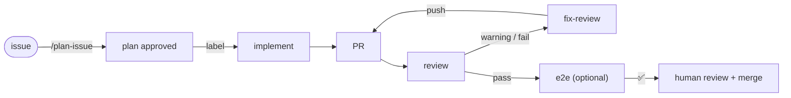

# patufet

Reusable GitHub Actions workflows that turn a GitHub issue into a merged-ready pull request
with [Claude Code](https://code.claude.com), keeping a human in the loop at the two points
that matter: **approving the plan** and **merging**.



Everything runs on `anthropics/claude-code-action`; this repository adds the **state machine**
(labels), the **review → fix loop** with a cycle limit, the **plan gate**, an optional **live
e2e stage** with Playwright, and the guards that make it safe and cheap enough to leave
unattended. Consumer repositories hold two short caller workflows (~120 lines of YAML,
mostly comments and permissions) and a few Markdown files.

## TL;DR

Three things to say to your coding agent (Claude Code, or anything that can run `gh`) from
inside your repository. [ADOPTING.md](ADOPTING.md) is the runbook it follows; the steps only a
human can do (install the [Claude GitHub App](https://github.com/apps/claude), set the
token secret) end up listed in the PR it opens.

**1. Adopt**

```
Adopt patufet in this repository: read
https://raw.githubusercontent.com/jmformenti/patufet/v1/ADOPTING.md and follow it.
```

Review and merge the PR, do the human steps it lists.

**2. Run one issue** (from Claude Code, in your repository)

```
/plan-issue 42
```

Iterate on the plan until you approve it. The agent then labels the issue and the flow
takes over: a PR on `agent/issue-42` appears, every push is reviewed and fixed until the
label is `pass` (or `needs-human-review` after the cycle limit, which mentions your
reviewer). With the e2e stage enabled, `pass` also runs the live test. Open the PR on
GitHub: its label tells you where it is.

A draft PR and the issue labelled `to-refine` mean the implementer has a question: answer
it in the issue and run `/plan-issue 42` again to update the plan; the implementer resumes
from the draft. When the label is `pass` and CI is green, you merge.

**3. Not convinced?**

```
Remove patufet from this repository: follow
https://raw.githubusercontent.com/jmformenti/patufet/v1/docs/uninstall.md
```

It opens a PR that removes the files and labels and tells you whether the secret and the
App are still used by anything else. Manual steps: [docs/uninstall.md](docs/uninstall.md).

The rest of this README is the manual path and the reference.

## Quick start (manual)

Requirements: a GitHub repository, the [Claude GitHub App](https://github.com/apps/claude)
installed on it, a `CLAUDE_CODE_OAUTH_TOKEN` (from `claude setup-token`) or `ANTHROPIC_API_KEY`
secret, and the `gh` CLI locally.

```bash
cd your-repo
bash <(curl -sSL https://raw.githubusercontent.com/jmformenti/patufet/v1/scripts/bootstrap.sh) \
  --reviewer your-github-login --language en          # add --with-e2e if the app can run on a runner
```

Then:

1. Fill in `test-command` (once, `fix-review` reuses it) and `ci-check-names` in
   `.github/workflows/patufet.yml`.
2. Optionally write your project checklist in `.github/patufet/review.md` / `implement.md`.
3. Commit and push.
4. Open an issue, run `/plan-issue <n>` from Claude Code, approve the plan → the flow starts.

## How a cycle goes

| Step | Trigger | Who | Result |
|---|---|---|---|
| Plan | you, `/plan-issue N` locally | Claude Code + you | comment `<!-- patufet:plan -->` + label `ready-to-implement` |
| Implement | label `ready-to-implement` | `implement.yml` | branch `agent/issue-N`, tests green, PR with `Closes #N` — or draft PR + `to-refine` when it has a question |
| Review | PR opened / pushed / ready | `review.yml` | inline comments, one report comment, label `pass` / `warning` / `fail` |
| Fix | label `warning` / `fail` | `fix-review.yml` | fixes pushed to the PR branch → review again (max `max-review-cycles`, then `needs-human-review`) |
| E2E | label `pass` | `e2e.yml` (optional) | app started by your `e2e-up.sh`, tested live with Playwright; `fail` sends it back, success mentions the reviewer |
| Merge | you | — | — |

The full state machine, markers and concurrency rules: [docs/architecture.md](docs/architecture.md).

## Configuration

Every knob is an input of the reusable workflows (language, model, `max-turns`, allowed tools,
label names, test command, cycle limit, hook paths...). Project-specific knowledge goes in
Markdown files appended to the base prompts. See [docs/customization.md](docs/customization.md).

## Cost and safety — read before enabling

- **Runs are billed against your Claude subscription/API key.** One issue typically costs one
  implement run, one review run per push, plus fix runs. Defaults follow real usage on
  habitus-trainer (`max-review-cycles: 10`, `max-turns` 200–400). See the cost section in
  [docs/architecture.md](docs/architecture.md#cost).
- **The agent has write access to your repository.** Only collaborators can start it (labels),
  and it only reads plans and review reports written by collaborators or the automation bots.
  Read [docs/security.md](docs/security.md) for the threat model before using this on a public
  repository.
- **Workflows cannot be tested locally.** Adopt on a small issue first, then pin the version.
  See [docs/troubleshooting.md](docs/troubleshooting.md) for the failure modes already met.

## Uninstall

patufet leaves files, labels and (if you created them for it) a secret and the App; nothing
else. [docs/uninstall.md](docs/uninstall.md) has the steps, for you or your agent: in-flight
work, files, only the labels created for patufet, and the secret and App.

## Repository layout

```
.github/workflows/   reusable workflows (workflow_call): implement, review, fix-review, e2e, mention
prompts/             base prompts (English), rendered with {{placeholders}} + your extension files
scripts/             helpers used by the workflows, and bootstrap.sh
templates/           files copied into consumer repositories
tests/               offline tests of the scripts and the bootstrap (tests/run.sh)
docs/                architecture, decisions, customization, e2e, security, troubleshooting,
                     migration, uninstall
ADOPTING.md          adoption runbook for coding agents
AGENTS.md            instructions for agents working on patufet itself
CONTRIBUTING.md      how to test, release and roll back
```

Versioning: consumers reference `@v1` (moving major tag) or an exact `@v1.x.y` (from
`v1.1.0`; `v1.0.0` predates the rename to patufet). Changes are listed in
[CHANGELOG.md](CHANGELOG.md), the release policy in [CONTRIBUTING.md](CONTRIBUTING.md#releasing).

## Trademarks

patufet is an independent open-source project. It runs [Claude Code](https://code.claude.com)
through Anthropic's `claude-code-action`, but it is not built, endorsed or sponsored by
Anthropic. "Claude" and "Claude Code" are trademarks of Anthropic, PBC, used here only to
describe compatibility.

## License

MIT — see [LICENSE](LICENSE).
