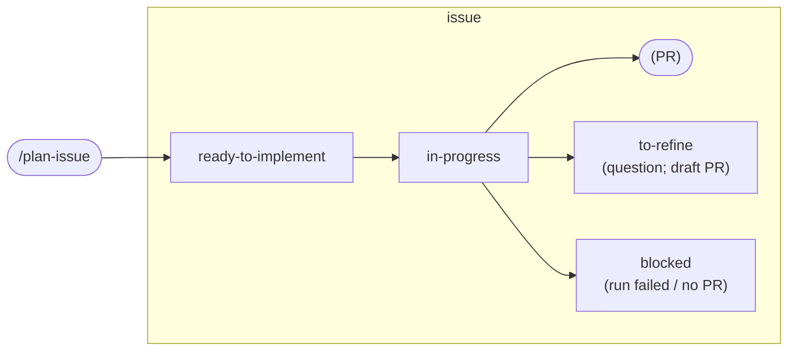
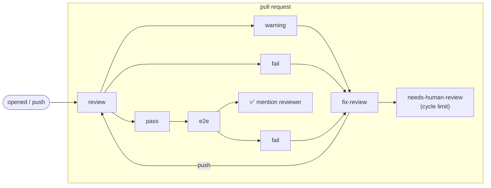

# Architecture

## Components

| File | Kind | Purpose |
|---|---|---|
| `.github/workflows/implement.yml` | reusable workflow | issue with approved plan → branch + PR |
| `.github/workflows/review.yml` | reusable workflow | review a PR, post report, label verdict |
| `.github/workflows/fix-review.yml` | reusable workflow | apply the latest report to the PR branch, enforce the cycle limit |
| `.github/workflows/e2e.yml` | reusable workflow | start the app via hooks, test live with Playwright MCP |
| `.github/workflows/mention.yml` | reusable workflow | ad-hoc `@claude` interactions |
| `prompts/*.md` | data | base prompts, rendered by `scripts/render-prompt.sh` |
| `scripts/*.sh`, `scripts/trusted-comments.jq` | helpers | context gathering, plan/report/verdict extraction with trust filter, cycle count, labelling, job summary |
| `templates/` | data | caller workflows, prompt extensions, e2e hooks, `/plan-issue` command |
| `tests/` | tests | offline tests of the scripts and the bootstrap, run by `self-check.yml` |

Why it is built this way: [decisions.md](decisions.md).

The consumer repository owns the **triggers** (`on:` + `if:` in the caller) and the
**project knowledge** (`with:` inputs, `.github/patufet/*`). Everything else — prompts,
guards, workarounds — lives here and is picked up by every consumer when the `v1` tag moves.

### How a reusable workflow gets its prompts

A `workflow_call` job runs in the **caller's** context: `github.event`, `github.repository`
and `actions/checkout` all refer to the consumer repository. To reach its own prompts and
scripts, each job downloads this repository's tarball at `job.workflow_repository` /
`job.workflow_sha` (the exact commit of the reusable workflow being executed) into
`$RUNNER_TEMP/patufet` — outside the workspace, so the implementing agent can never
commit it. Prompts are rendered by substituting `{{placeholders}}` and appending the
consumer's extension file, then passed to the action's `prompt` input.

## State machine

Labels drive everything. Names are inputs; the defaults are:

Rules that make it work:

- `pass`, `warning`, `fail` are **mutually exclusive** and always applied as *two* `gh pr edit`
  calls (remove all, then add one). GitHub only emits a new `labeled` event — the trigger of
  `fix-review` and `e2e` — when the label really changes; a combined
  `--add-label X --remove-label X` does not re-fire when the verdict repeats.
- Verdict labels are applied **by Claude inside the action run**, because that is the only
  moment the Claude App token is alive (the action revokes it as its last step) and events
  created with `GITHUB_TOKEN` never trigger other workflows. A deterministic step then
  compares the label with Claude's **structured output** (`--json-schema`) and repairs the
  label with `GITHUB_TOKEN` if they disagree — flagging that the next stage must be started
  by hand in that case. No second model run is needed. When there is no structured output,
  only the marker of the comment posted by *this* run counts (`cycle=N` / `run=ID`), never
  an earlier one (`scripts/read-verdict.sh`).
- The review cycle counter is the number of trusted comments carrying
  `<!-- patufet:review`. `fix-review` refuses to run once it reaches `max-review-cycles`
  and labels `needs-human-review` instead.
- The implementer job fails (and labels `blocked`) when the action ends green without having
  opened a PR or marked the issue `to-refine` — the action can finish "successfully" after
  tool denials without doing anything.

## Markers

Machine-readable HTML comments, invisible on GitHub, independent of the `language` used for
the human text:

| Marker | Written by | Read by |
|---|---|---|
| `<!-- patufet:plan -->` | you (`/plan-issue`) | implement, review, e2e (`scripts/find-plan.sh`) |
| `<!-- patufet:review cycle=N verdict=V -->` | reviewer | review (fallback verdict), fix-review, cycle counter |
| `<!-- patufet:e2e run=ID.ATTEMPT verdict=V -->` | e2e tester | e2e (fallback verdict) |

Only comments by `OWNER` / `MEMBER` / `COLLABORATOR` authors or by the `claude[bot]` /
`github-actions[bot]` bots are considered (see [security.md](security.md)).

## Concurrency

| Workflow | Group | Cancel in progress |
|---|---|---|
| implement | `patufet-implement-<repo>-<issue>` | no (a running implementation is never killed) |
| fix-review | `patufet-implement-<repo>-pr-<pr>` | no |
| review | `patufet-review-<repo>-<pr>` | yes (a review of a superseded diff must not label after a newer one) |
| e2e | `patufet-e2e-<repo>-<pr>` | yes |

Different issues / PRs run in parallel.

## Cost

Per issue, in Claude runs (each bounded by `max-turns`):

- 1 × implement (`max-turns` 400 by default; a medium full-stack issue used ~200 turns in
  practice, a small one far fewer).
- 1 × review per push to the PR (default `max-turns` 400).
- up to `max-review-cycles − 1` × fix-review (default limit 10 → at most 9 fix runs).
- 1 × e2e per `pass` (optional, default `max-turns` 200).

Levers: `max-review-cycles`, `max-turns`, `model` (e.g. a cheaper model for review), keeping
issues small (the plan gate is the real cost control), and not enabling e2e until the rest is
stable. There is no hard budget per run in the action; `max-turns` is the only cap.

## Observability

Every job writes a summary (the run page on GitHub): outcome, turns, duration and the cost
Claude Code reports for the run, plus the verdict and cycle. With an OAuth token the cost is
what the run would cost on the API, not what the subscription is charged.

## Testing

The workflows cannot run locally (`act` cannot run the Claude action). What is verifiable,
all run by `self-check.yml`:

- `actionlint` on the reusable workflows and on the caller templates, `shellcheck` on the
  scripts.
- `tests/run.sh`: the scripts (trust filter, verdict, plan, linked issue, labels, prompt
  rendering), the bootstrap's idempotence, and the consistency of prompts, workflows and
  docs, offline with a stubbed `gh`.
- Real behaviour: a full cycle on a sandbox repository (see
  [CONTRIBUTING.md](../CONTRIBUTING.md#checking-a-change)).
